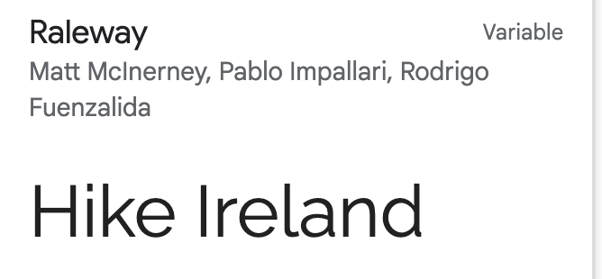

# Hike Ireland
- Link to deployed site\
Hike Ireland is a responsive website with information and inspiration for hikes in Ireland. It allows users learn about the benefits of hiking and find inspiration for hikes in every province.
- Add image from am i responsive here
- shields.io badges 

# User Experience UX
## User Stories
### First Time Visitor Goals
- As a first time visitor I want to be able to view the site ona range of devices
- As a first time visitor I want to be able to easily navigate around the website
- As a first time visitor I want to find their social media profiles 
### Returning Visitor Goals
- As a returning visitor I want some inspiration for hikes by looking at images of beautiful scenery in various hiking locations around Ireland.
- As a returning visitor I want to signup to the newsletter for more information
### Frequent Visitor Goals
- As a frequent user I want some updated images and information on hikes 

# Design
## Colour Scheme
I used Adobe color wheel to extract themes from the hero image.\

## Typography
I used google fonts and decided to pair Playfair display, a serif font, with Raleway a sans serif font.

## Imagery

# Features
## Current Features
### Navigation Bar
### Landing Page Image
### Benefits of Hiking Section
### Top Hikes in Ireland Section
### Signup Section
### The footer
### The Gallery Page
### The Signup Page
## Features Left to Implement

# Testing
## Validator Testing
## Unfixed Bugs
# Deployment

# Credits
## Content
## Media
