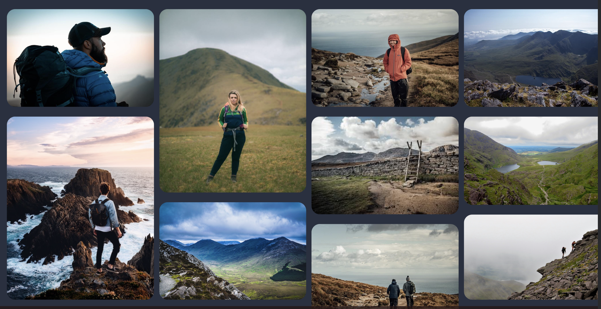

# Hike Ireland
- Link to deployed site\
Hike Ireland is a responsive website with information and inspiration for hikes in Ireland. It allows users learn about the benefits of hiking and find inspiration for hikes in every province.
- Add image from am i responsive here
- shields.io badges 

# User Experience UX
## User Stories
### First Time Visitor Goals
- As a first time visitor I want to be able to view the site ona range of devices
- As a first time visitor I want to be able to easily navigate around the website
- As a first time visitor I want to find their social media profiles 
### Returning Visitor Goals
- As a returning visitor I want some inspiration for hikes by looking at images of beautiful scenery in various hiking locations around Ireland.
- As a returning visitor I want to signup to the newsletter for more information
### Frequent Visitor Goals
- As a frequent user I want some updated images and information on hikes 

# Design
## Colour Scheme
I used Adobe color wheel to extract themes from the hero image.\

## Typography
I used [Googlefonts](https://fonts.google.com/) and decided to pair Playfair display, a serif font, with Raleway a sans serif font.\

## Imagery
All images on the site were sourced from [Unsplash.com](https://unsplash.com/)\
I used images of Irish mountain scenery and wildlife to inspire potential hikers.

# Features
## Current Features
### Navigation Bar

- Navigation bar is found on all four pages and it is identical on all to allow easy navigation without using the back button. 
- Current page is underlined so user can clearly see which page they are on.
- Links open in new tab

### Landing Page Image

- The landing page image has an eyecatching image of beautiful scenery to grab the users attention.
- There is a covertext on the image to make clear what the website is about.

### Benefits of Hiking Section

- The benefits of hiking section goes through some of the benefits of hiking.
- The user will see the positive impact of hiking and be inspred and encouraged to get out and enjoy Ireland's scenery

### Top Hikes in Ireland Section

- This section contains the top hikes in Ireland by province. We have chosen to show the top 6 for each.
- There is a clickable link in this section which brings the user to the Hikes Gallery page. It will open in a new tab 

### Signup Section

- In the signup section there is a form which the user can fill out to signup to the monthly newsletter
- The signup section contains a cover text with information about the monthly newsletter.
- when the user completes the form they will be brought to a thankyou page thanking them for subscribing.

### The footer

- The footer holds links to social media 
- It also has a copyright notice
- When the user clicks on social media links they will open in a new tab

### The Gallery Page

- The gallery page contain inspiring images of the irish great outdoors. 
- This page will encourage users to try hikes in different parts of the country.
- It will also help them decide which hikes they would like to try out.

### The Signup Page

- This page will allow the user to get signed up for the monthly newsletter and get information about meetups. 
- There is a form which the user can fill out to signup to the monthly newsletter.
- The user will be asked to submit their first name, last name and email address.
- There is a covertext with an irish proverb and english translation. 

### The Thankyou Page

- the thankyou page thanks users for subscribing. 
- It opens in a new tab

## Features Left to Implement
- Make the top hikes section have clickable links to each hike with more inforamtion and images of each individual hike

# Testing
I have tested tested the website on various different screen sizes in dev tools. Lighthouse showed I had poor performance due to image size so I resized images with Mac Preview.

## Validator Testing
### HTML
- index.html  No errors were returned when passing through the official [W3C validator](https://validator.w3.org/nu/#textarea)
- gallery.html  No errors were returned when passing through the official [W3C validator](https://validator.w3.org/nu/#textarea)
- signup.html  No errors were returned when passing through the official [W3C validator](https://validator.w3.org/nu/#textarea)
- thankyou.html  No errors were returned when passing through the official [W3C validator](https://validator.w3.org)
### CSS
- style.css No errors were found when passing through the official [Jigsaw validator](https://jigsaw.w3.org/css-validator/validator)

## Unfixed Bugs
- Text and image in benefits section not centred on screen sizes of 600px and under

# Deployment
The site was deployed to GitHub pages.\
The steps to deploy are as follows:
- In the GitHub repository, navigate to the Settings tab
- From the source section drop-down menu, select the Master Branch
- Once the master branch has been selected, the page will be automatically refreshed with a detailed ribbon display to indicate the successful deployment.

# Technologies Used 
## Languages used
- HTML
- CSS
## Frameworks, Libraries & Programs Used
- Google Fonts - Fonts Raleway and Playfair Display were imported for use throughout the project
- Font Awesome - Icons for the benefits of hiking section, top hikes section and footer were used from this site
- GIT - used for version control
- GITHub - code pushed from GIT and stored in GITHub
- GITPod - workspace used in gitpod to work on project then push to github
- Dev Tools - were used to check how project looked on different screen sizes and also to troubleshoot errors and try out changes
- Unsplash - stock image site used for images on the website
- Mac Preview - used to resize large images

# Credits

## Content
-
-
## Media
-
-
-
-
-

